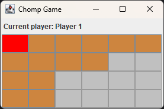

# Chomp Game (Java + Swing)

A simple two-player **Chomp Game** implemented in Java using Swing, following a clean MVC-inspired architecture with separate model, view, and controller layers.  
This project was developed as part of an academic assignment requiring class design, documentation, and GUI implementation.

GitHub Repository: https://github.com/NoMooncake/ChompGame

---

## Game Overview

**Chomp** is a turn-based strategic game played on a chocolate bar.

- The square at the **top-left corner `(0,0)`** is the **poison square** (colored red).
- Players take turns clicking any **uneaten** cell.
- When a cell is chosen, **that cell and all cells to its bottom-right** are eaten.
- The player who is forced to eat the poison square **loses immediately**.

---

## Demo Screenshot



---

## How to Run

### Option 1 — IntelliJ IDEA
1. Clone the repository:
   ```bash
   git clone https://github.com/NoMooncake/ChompGame
   cd ChompGame
   ```
2. Open the folder in IntelliJ.
3. Run: `src/chomp/ChompGUIApp.java`.

---

## Project Structure

```
src/chomp/
├── Board.java
├── Cell.java
├── Player.java
├── Game.java
├── CHOMPGame.java
├── ChompFrame.java
├── GamePanel.java
├── InfoPanel.java
├── Display.java
└── ChompGUIApp.java
```

---

## Design Patterns Used
- MVC Architecture  
- Template Method Pattern  
- Event-Driven Programming  
- Lightweight Façade Pattern  

---

## Author
Davie (Yue Wu)  
GitHub: https://github.com/NoMooncake
